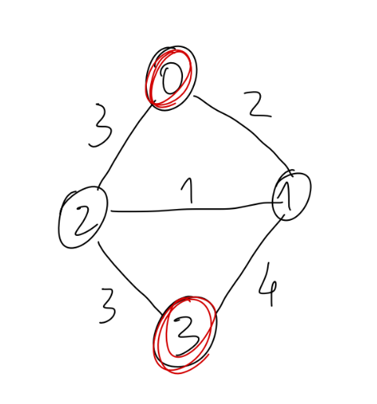

## Shortest Path


```bash
ghci> shortestPath gTest4 "0" "4"
```

```bash
gTest4 :: RoadMap

gTest4 = [ ("0","1",6), ("0","3",1), 
           ("1","2",5),("1","3",2),("1","4",2),
           ("2","4",5),
           ("3","4",1)
         ]
```

```bash
adjList = [ ("0", [("1", 6), ("3", 1)]),
            ("1", [("0", 6), ("2", 5), ("3", 2), ("4", 2)]),
            ("2", [("1", 5), ("4", 5)]),
            ("3", [("0", 1), ("1", 2), ("4", 1)]),
            ("4", [("1", 2), ("2", 5), ("3", 1)])
          ]
```

```bash
start = "0"
goal = "4"
initialQueue = [("0", [], 0)]

Iteration 1:
    City: "0", Path: [], Distance: 0, minDist: INFINITE
    Neighbors: [("1", 6), ("3", 1)]
    Add to Queue: 
        -> ("3", ["0"], 1) - Distance to "3" is 1
        -> ("1", ["0"], 6) - Distance to "1" is 6
    New Queue: [("3", ["0"], 1), ("1", ["0"], 6)]
    Visited: ["0"]

Iteration 2:
    City: "3", Path: ["0"], Distance: 1, minDist: INFINITE
    Neighbors: [("0", 1), ("1", 2), ("4", 1)]
    Add to Queue:
        -> ("4", ["3", "0"], 2) - Distance to "4" through "3" is 2
        -> ("1", ["3", "0"], 3) - Distance to "1" through "3" is 3
    New Queue: [("4", ["3", "0"], 2), ("1", ["3", "0"], 3), ("1", ["0"], 6)]
    Visited: ["0", "3"]

Iteration 3:
    City: "4", Path: ["3", "0"], Distance: 2, minDist: INFINITE
    Goal City Reached with Distance 2
    Update minDist to 2
    Reverse ["4", "3", "0"] to ["0", "3", "4"] and add to Paths
    Paths: [["0", "3", "4"]]

Iteration 4:
    City: "1", Path: ["3", "0"], Distance: 3, minDist: 2
    Distance > minDist, so no shorter path can be found from this point.
    Skip further exploration of this path.
    ...

...

Final Paths

At the end, the shortest paths found are [["0", "3", "4"]] with a minimum distance of 2.
```



```bash
ghci> shortestPath gTest5 "0" "3"
[["0","1","2","3"],["0","2","3"],["0","1","3"]]
```
